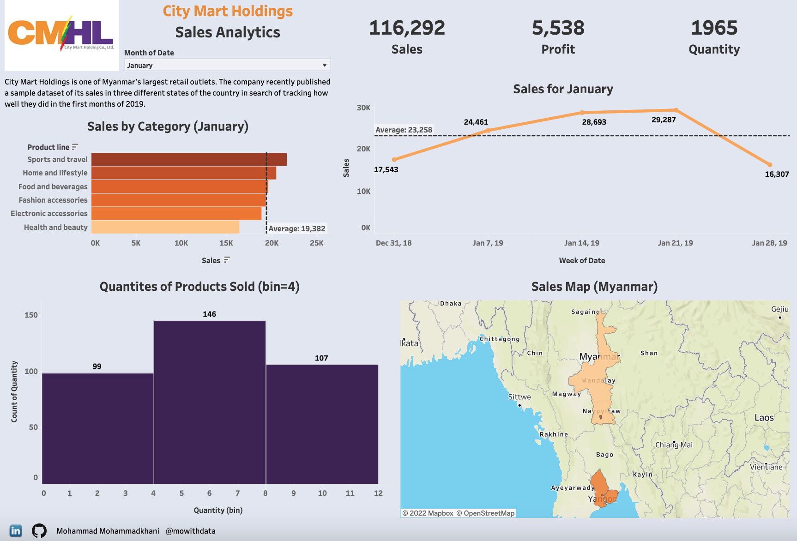

# City Mart Holdings Sales Analytics

While sales reports are widely popular in business, there are a few public datasets that analysts may find useful for testing and experimenting. City Mart Holdings is one of Myanmar's largest retail outlets. The company recently published a sample dataset of its sales in three different states of the country in search of tracking how well they did in the first months of 2019. 

* Created a Sales Report in Tableau giving detailed insights on best-selling product lines and popular stores.
* Imported spatial files and used Tableau Query to generate the sales map.
* Answered business questions about if customers tend to buy at least four items together.
* Calculated profits using the cost of goods sold.
* Improved user experience by applying conditional formatting, drillthrough filters and, visual interactions.

